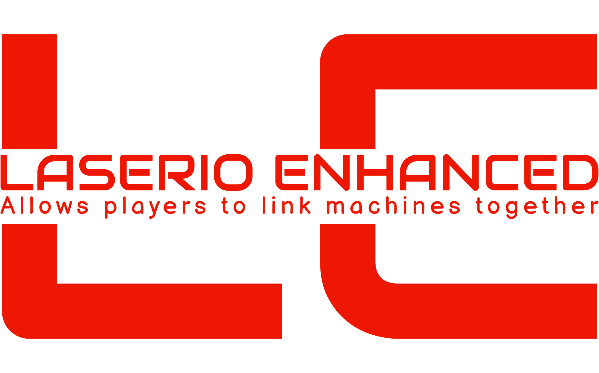
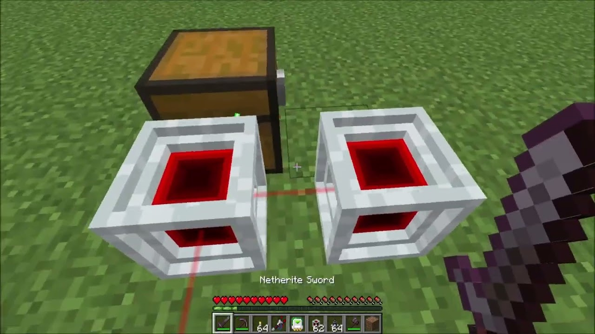

   
  <a href="https://www.youtube.com/watch?v=o22Pq9NmTSY">Mod video</a> •
  <a href="https://github.com/tacaly/LaserIO-Enhanced/actions/workflows/build.yml">Build</a> •
  <a href="https://discord.gg/aNjHXvkPck">Discord</a> •
  <a href="#file-structure">Structure</a> •
  <a href="#snapshot">Snapshot</a> 
  Can't have DireWire without Wires!
  

 

The plugin is called "LaserIO" and it allows players to link different machines together in their Minecraft world. The plugin adds a new item to the game called "nodes" which can be placed on the ground like any other block. Once placed, players can right-click on a node to access its GUI, which allows them to connect the node to other machines in the world.

To connect a node to a machine, the player must simply right-click on the machine with the node in hand. The node will then need to be linked to the machine with the GUI config and will display the machine's current status (e.g. active, inactive) by it's "Laser" lines comming from the "node". Players can connect as many machines as they want to a single node, and can even connect multiple nodes together to create a network of connected machines.

In addition to displaying the status of connected machines, the nodes also allow players to remotely control the machines. For example, if a player connects a furnace to a node, they can use the node to turn the furnace on or off, or to adjust its settings.

Overall, the "LaserIO" plugin adds a new level of automation and convenience to Minecraft gameplay by allowing players to easily connect and control their machines through the use of nodes.

## Adding your own lang
- Go to LaserIO-Enhanced\src\main\resources\assets\laserio\lang
- Copy a file and start translation

## So what is "Enhanced?"
This "Enhanced" "fork" of the LaserIO repo is a ""bleed"" build. Meaning that ALL requests that makes the mod better will be put in.

Waterloggable nodes and connectors #80
https://github.com/Direwolf20-MC/LaserIO/pull/80

Show card type name and color on the card GUI #120
https://github.com/Direwolf20-MC/LaserIO/pull/120
